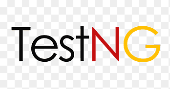

## Hi 👋, I'm Kuldeep Kaur and I am a Software Developer In Test.
# I am passionate about teams that deliver value to customers on frequent basis.

  <!-- 
   -->
  
  

#### Now

- ✨ Working and Contributing @ Bill.com;
- :fire: Interested in Test Automaiton and DevOps;
- :calendar: Looking for contributing to Java and JavaScript based test automation projects.

#### Bio

- 🏢 I'm currently working at **Bill.com**
- ⚙️ I use daily: `.java`, `.js`, `.json`
- 🌍 I'm mostly active within the **Testing Community**
- 🌱 Learning all about **Test automation frameworks** and **DevOps**
- 💬 Ping me about **Selenium**, **Appium**, **WebDriverIO**, **Test automation plugins**
- 📫 Reach me: [LinkedIn.com/kuldeepk-kaur](https://www.linkedin.com/in/kuldeepk-kaur/)
- 📝 Checkout my [Resume](resume.pdf).

#### My Current Stack

             

#### Development Activity:

<b>⚡ Github Stats</b>

 

<!-- <b>&#128200; Competitive Programming</b>

 -->

#### Connect With Me

 
<!--a href="https://www.facebook.com/kuldeepk-kaur">
  
</a-->

